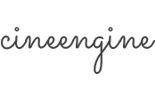

# Focus on creating good visuals
{: .fs-9 }

Cine Engine Studio is the project management, production tracking, media review platform and set of production pipeline tools that teams in the creative industries use to collaborate. 

We connect people, simplify workflows and increase studio efficiency.

[Get started now](#getting-started){: .btn .btn-primary .fs-5 .mb-4 .mb-md-0 .mr-2 } [View it in action](https://youtube.com/cineengine){: .btn .fs-5 .mb-4 .mb-md-0 }

{: .fs-6 .fw-300 }

## Solutions 

[RAPTOR]({{ site.baseurl }}){: .btn .btn-primary .fs-5 .mb-4 .mb-md-0 .mr-2 } [LiSSA]({{ site.baseurl }}){: .btn .btn-primary .fs-5 .mb-4 .mb-md-0 .mr-2 }

---

## Getting started

### RAPTOR

Built for Producers and artists alike. 

[RAPTOR](https://cineengine.com/raptor) is the project management, production tracking and media review platform that teams in the creative industries use to collaborate. RAPTOR connects people, simplifies workflows and increases studio efficiency. Collaborate with multiple teams within your company using production-proven tools to ensure your projects reach the finish line on time and on budget.

View the [RAPTOR's document page]({{ site.baseurl }}) for more information.

- [See Producer's Guide]({{ site.baseurl }})
- [See Artists's Guide]({{ site.baseurl }})

### LiSSA

LiSSA is – a linear sequence of specialized Algorithms. Designed to facilitate a smooth pipeline form Asset creation to final renders. 
It's VFX/Animation Studio Framework made for TDs and Scripters involved in Production Tracking, Asset Management, Workflow and Pipelines used by Production Managers and CG Artists.

<small>LiSSA's documents are still in development. </small>

## Frequently Asked Questions

We try to document common queries raised by clients, but please do hesitate to contact us if you can't find answers to your questions.

- [Frequently Asked Questions]({{ site.baseurl }})

---

## About Cine Engine

Cine Engine thrives on the idea of helping boutique CG/VFX studios to manage their production and pipeline efficiently.

Our solutions are always inline with SOLID Software Design Principles i.e. 

- Single Responsibility Principle
- Open/Closed Principle
- Liskov Substitution Principle
- Interface Segregation Principle
- Dependency Inversion

Our extensive experience allows studios to have easy time maintianing pipeline and focus more on the artistic work.

Visit [Cine Engine](https://cineengine.com/) for more information.

Cine Engine is conceived, maintained & &copy; 2019 by [Dushyant Kashyap](http://dushyant.info).

### License

These products are distributed by an [MIT license](https://github.com/pmarsceill/just-the-docs/tree/master/LICENSE.txt).

### Contributing

If you want to contribute, please first discuss the change you wish to make via issue,
email, or any other method with the owners of this repository before making a change. Read more about becoming a contributor in [our GitHub repo](https://github.com/cineengine/cineengine-docs#contributing).

### Code of Conduct

Cine Engine is committed to fostering a welcoming community.

[View our Code of Conduct](https://github.com/cineengine/cineengine-docs/tree/master/CODE_OF_CONDUCT.md) on our GitHub repository.

